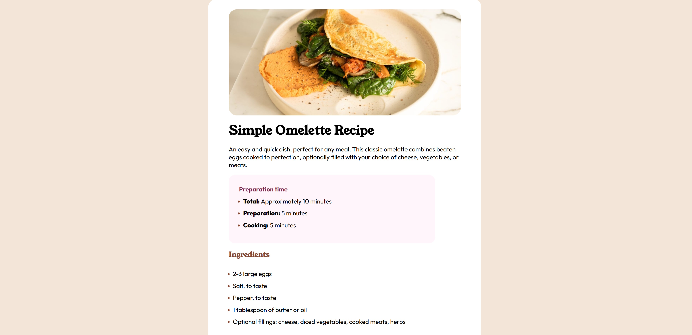

# Frontend Mentor - Recipe page solution

This is a solution to the [Recipe page challenge on Frontend Mentor](https://www.frontendmentor.io/challenges/recipe-page-KiTsR8QQKm). Frontend Mentor challenges help you improve your coding skills by building realistic projects. 

## Table of contents

- [Overview](#overview)
  - [The challenge](#the-challenge)
  - [Screenshot](#screenshot)
  - [Links](#links)
- [My process](#my-process)
  - [Built with](#built-with)
  - [What I learned](#what-i-learned)
  - [Continued development](#continued-development)
  - [Useful resources](#useful-resources)
- [Author](#author)
- [Acknowledgments](#acknowledgments)

## Overview

### Screenshot




### Links

- Solution URL: [Add solution URL here](https://github.com/Matthew-Flint/Recipe-Page)
- Live Site URL: [Add live site URL here](https://matthew-flint.github.io/Recipe-Page/)

## My process

### Built with

- Semantic HTML5 markup
- CSS custom properties
- Flexbox


### What I learned

I learned how to manipulate the styling of the markers for lists, which I'd never done before. A simple Google search helped me to find the following CSS:

```css
li:: marker {
  color: var(--Rose-800);
}
```
This allowed me to make the numbers and dot points for the ingredients and directions a different colour to the main text. 


### Continued development

I'm still getting a hang of spacing tables. I used Flexbox to try and get the spacing right, but it's still not quite in line with the original design. I also feel like the responsiveness for mobile devices could do with some work, especially on the card with the rose background that contains the preparation information. It gets less centered as the device width shrinks, and I'm not sure yet how to go about fixing it. 

## Author

- GitHub - [Matthew Flint](https://github.com/Matthew-Flint)
- Frontend Mentor - [@Matthew-Flint](https://www.frontendmentor.io/profile/Matthew-Flint)
